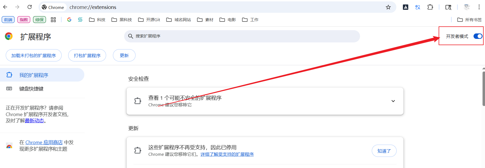
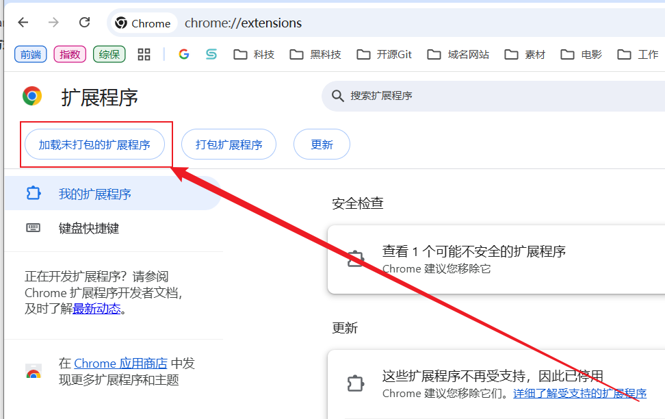
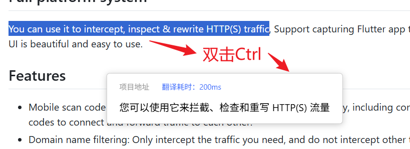

# chrome-translator
使用 Chrome 扩展的方式实现的翻译工具


### 安装

1、下载本仓库到电脑仓库位置(不建议放桌面)

2、在谷歌浏览器输入 **chrome://extensions/** 进入扩展程序安装界面

3、手动打开开发者模式



4、加载未打包的拓展程序，选中仓库文件夹



5、重启Chorme浏览器


### 使用方法

划词翻译：



```
- 鼠标选中要翻译的中/英文
- 双击 Ctrl 按键即可
```

拓展面板操作：

```
- 打开本工具的拓展面板
- 会自动从剪贴板读取内容，并立即翻译
- 也可自行输入文本，然后点击“翻译文本”
```


### 注意

- 首次运行翻译功能会自动下载AI模型(大概几十M)
- 下载完成之后再次运行翻译功能即可
